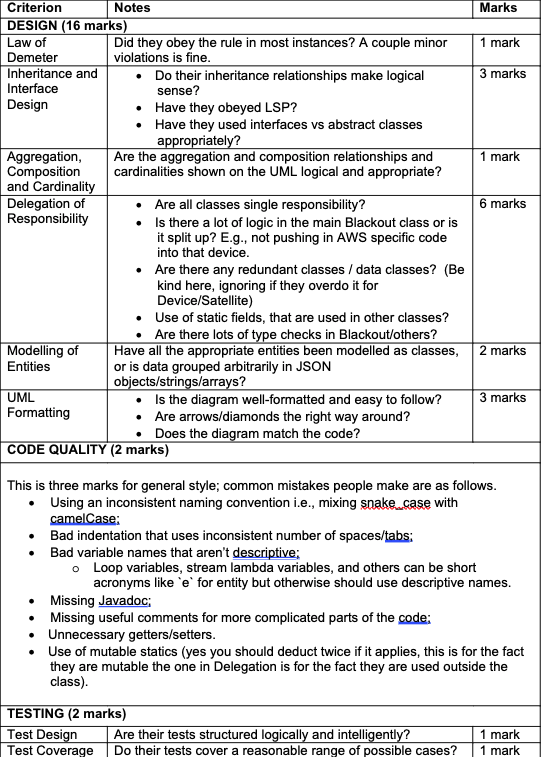

# Back in Blackout: Assignment Marking

> Don't share this with students.

You will be paid for 10 minutes per student that you as a tutor have. You will need to mark 3 sections for each assignment:

* Elephant Satellite Subjective (1.5 marks)
* Design (16 marks)
* Code Quality (2 marks)
* Testing (2 marks)

## Marking with XMark

### XMark

Using SSH/VLAB (recommendation to use VLAB, SSH with GUI on CSE is quite slow).

```
2511 classrun –mark
```

You can then go to Select Assign -> ass1 then Select Group -> Your Tute Class (there are two sections).

### Viewing Submissions

You can either use the [AllTutes.md](tutor-notes/AllTutes.md) file, which lists zID + name to a link to their assignment Gitlab.  Or use tears.
-	You can already just access the design pdf via xpdf design.pdf
-	But you can also access the code by doing $A/unzip and look in the src directory

### Marking

You can select a submission by then double clicking on one of the zID + names that show up after selecting a group.
-	You can scroll through a submission using the scrollbar on the right or your mouse’s scroll-wheel
-	By clicking on any line in the submission you can leave a comment, you can do this to describe student issues
-	After clicking “Assess” you can assign the marks for each category as well as a comment for each category, try to leave a detailed comment for Design at least.
-	After confirming that just press save on the top left, and you are done with that submission.

### Automarking Problems

If you think there is a problem in the automarking for a student's assignment, then let Nick or Braedon know.

### Autotest mark of 0

If a student has received an autotest mark of 0 (or a very low mark), notify Nick/Braedon and we'll investigate why and resolve the issue (so you don't have to waste time looking into it).

## Handmarking



## Elephant Satellite Marking

The elephant satellite is a bit of a different one, in this one they have to develop their own algorithm and there are a few suggestions in the assignment specification.  Don't stress about this, just read through the rationale (if they don't mention it in rationale they get 0/1.5 for the subjective mark) and ensure they have told you *why*, if it sounds interesting/more complicated then a brute force method give 0.5-1.5 based on how interesting/complicated it is.

## Rationale

The rationale will be in the gitlab repository/tears along with the UML.  Feel free to give them marks for things they clearly explain how they would have done them given time.  For example, if they state very clearly that they wanted to move code from the simulate function in the blackout controller to the devices/satellites and explains how (maybe with a reference to a design smell) then you can give them a couple of marks for that (reduce penaltly basically).

We want to be lenient here, but they need to say *why*, just saying how is not good enough.

### High Scoring Example

https://gitlab.cse.unsw.edu.au/COMP2511/21T3/students/z5303634/assignment

#### Design Feedback

- A ton of over-abstraction
- UML is strong
- Good use of inheritance/classes
- No major class holds all the responsibility.

#### Marking

Design:
- Law of Demeter: 1
- Inheritance/Interface: 3
    - Note on over-abstraction
- Aggregation: 1
- Delegation: 6
- Modelling of entities: 2
- UML Formatting: 3

Code Quality:
- 2, good.

Tests:
- 2, good tests.

Has an interesting elephant satellite strategy so 1.5/1.5, funnily though it's worse then brute force!

| Automarking | Elephant Satellite | Handmarking | Total |
| ----------- |  -----------| ----------- | ----- |
| 17.5 / 18.5   | 1.5/1.5 | 20 / 20     | 39 / 40|

### Low Performing Example

https://gitlab.cse.unsw.edu.au/COMP2511/21T3/students/z5255056/assignment/

#### Design Feedback

- No use of inheritance to implement behaviour outside of Relay
- Helper class contains vast majority of the logic (https://gitlab.cse.unsw.edu.au/COMP2511/21T3/students/z5255056/assignment/-/blob/master/src/main/unsw/utils/Helpers.java)
- Has a few too many comments tbh.
- UML Inheritance arrows are wrong
- rationale is good here and recognition of a universal object made me change my inheritance from 1.5 -> 2

#### Marking

Design:
- Law of Demeter: 0
    - Helper class
- Inheritance/Interface: 2
    - While inheritance exists it's not utilised in any meaningful way
- Aggregation: 1
- Delegation: 2
    - The use of a helper class is a *bit* better, but not really.
- Modelling of entities: 2
- UML Formatting: 1.5
    - Incorrect arrows for inheritance

Code Quality:
- 2, comments are quite weak, but overall it's okay.

Tests:
- 0, no tests.

| Automarking | Elephant Satellite | Handmarking | Total |
| ----------- |  -----------| ----------- | ----- |
| 9.5 / 18.5   | 0/1.5 | 10.5 / 20     | 20 / 40|

### Medium Performing Example (design)

https://gitlab.cse.unsw.edu.au/COMP2511/21T3/students/z5252442/assignment 

#### Design Feedback

- Task 2/3 is mostly implemented entirely implemented through the blackout controller with most classes just acting as data classes
- In saying that files are very well abstracted (the logic that is specific to files themselves that is, the tranferring is still mainly in blackout) this definitely means they got some good design.
- UML Diagram looks fine though I would point out the overuse of aggregation, definitely satellites/devices can be composition relationships.
- Rationale explains what not why, regardless gave 1/1.5 for it since they lost all the marks in autotesting due to a misconception around it.

#### Marking

Design:
- Law of Demeter: 0
    - They abuse law of demeter through code like below (in controller)

```java
Map<String,File> downloadMap = receiver.getDownloads();
            File[] downloads = downloadMap.values().toArray(new File[0]);
            for (File file : downloads) {
                if (!communicableEntitiesInRange(file.getFromId()).contains(receiver.getName())) {
```

- Inheritance: 3
    - They have used interfaces/classes well here, because I'll be harsher elsewhere, it's fine to be kinder here
- Aggregation: 1
    - UML is fine (though note overuse of aggregation)
- Delegation: 1-2
    - Basically everything in blackout and a lot of type checks.
- Modelling: 2
    - Great modelling
- UML: 3
    - Great UML formatting

Code Quality:
- 2 strong quality.

Tests:
- 2, good tests

> No rationale for elephant that doesn't show anything bar the brute force method.

| Automarking | Elephant Satellite | Handmarking | Total |
| ----------- |  -----------| ----------- | ----- |
| 18.5 / 18.5   | 0/1.5 | 14 / 20     | 32 / 40|

