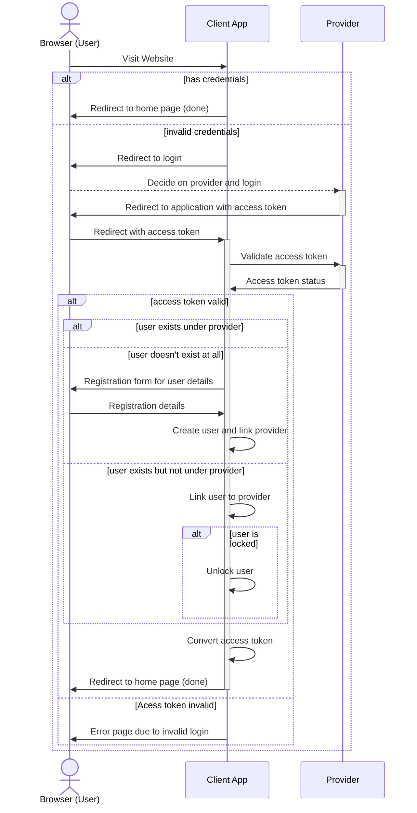

# Tutorial 05 - State, Strategy, Observer

In this tute you'll cover;
- State Pattern
- Strategy Pattern
- Observer Pattern

as well as the basics of SSO (Single Sign On) and authentication to help you with the lab.

### State-Strategy-Observer or SSO (pun intended)

In the lab you'll be implementing an single sign on (SSO) system to allow you to login/signup users to an application through the use of many strategies such as Hoogle, FaceTome, and InstaHam.

To help you begin with implementing that let's discuss the basic mechanics behind SSO and how it works.

| :information_source:  NOTE: This problem has been massively trivialised and is more focused on the browser side changes in user state.  This is so that very little network domain knowledge is required to be able to solve the lab.  It invents it's own protocol that is *roughly* based on OAuth2 (nowadays it's more common to use SAML due to numerous issues with OAuth but SAML is significantly more complicated). |
| --- |

#### Authentication

> Authentication is confirming that the user is who they say they are, and authorization is the act of giving users permission to a set of resources/actions.  We are merely concerned with authentication (i.e. 'login') in this lab/tute.

1. Why do we need authentication for websites such as gmail/myunsw/facebook?

> Since most of the information on those pages are private; authentication provides a way to ensure that the user is who they say they are and that they do truly have access to those resources (leads into authorization).

2. Does anyone know what SSO / External Login is?

> SSO is a flow that enables us to use a set of credentials (such as a google login) for multiple websites.

3. Let's look at the below SSO flow and talk about the following concepts
  - Session cookies

> Session cookies are stored in the browser and are typically used to store access tokens, they are only accessible by the domains that created them and are typically quite secure.

  - Does this look like any concept we've discussed this week?

> The state pattern and the strategy pattern (atleast).

<details>
    <summary>SSO Flow</summary>



</details>

A few more details that aren't explicit in the above system;
- Providers may require different methods to login (username + password, email + password, two factor authentication, unique code sent via email, and so on...)
- The access code will be the following object (for all providers)

```javascript
{
    "email": "<email address of user>",
    "access_token": "<some generated token>",
    "expires_at": "<local date with when this will expire>"
}
```

- Providers are linked to a common user via the email address

The above diagram may be a bit hard to process (due to it's very concise nature) so to help you understand the flow let's break it down into a series of questions.

### Design Patterns A) State

1. What do state patterns allow you to cleanly represent

> Transitions between states where representing it procedurally would result in a lot of spaghetti code (a lot of if statements and complex jumps).  They also allow you to extend the system with future states and/or transitions much easier since you don't have to try to modify a gigantic function.

2. What is a state table and why are they useful in this case

> State tables enable you to map every transition from each state and allow you to clearly see the logic required for each state, they map pretty well to code typically.

3. Write a state table for the above problem.

> TODO (I'll do it a bit later today)

### Design Patterns B) Strategy

1. How could you use the strategy pattern in this example
2. Give an example of why that's useful here, and the benefits of the strategy pattern over just if statements.

### Design Patterns C) Observer

In this example we won't be implementing actual frontends / webservers to run this (due to the extra complexity that requires) and will instead be using observer patterns to simulate asynchronous requests.

An example is shown below (from one of the provided tests in the lab)

```java
// Create a provider
Provider hoogle = new Hoogle();
hoogle.addUser("user@hoogle.com.au", "1234");

ClientApp app = new ClientApp();
// Allow users to login using hoogle
app.registerProvider(hoogle);

// Create a browser instance
Browser browser = new Browser();
// Visit our client application
browser.visit(app);

// Since the browser has no initial login credentials
// it'll cause us to redirect to a page to select providers
assertEquals(browser.currentPage, ClientApp.Page.ProviderSelection);

// Select the provider and get a form
Form form = currentTab.selectProvider(hoogle);
assertEquals(browser.currentPage, ClientApp.Page.ProviderForm);

// Fill in the form using the provider
form.fillIn(Hoogle.generateFormSubmission("user@hoogle.com.au", "1234"));

// This should inform the browser that the form is filled
// Which will then authenticate the form with the third party provider
// which causes the browser to redirect back to the login page with token
// which causes the client application to validate the token
// resulting in a redirect back to the home page.
assertEquals(browser.currentPage, ClientApp.Page.HomePage);
```

1. Why is the observer pattern useful here?  Think about encapsulation and trying to prevent every function from just being public.

> The observer function lets us avoid having to have functions like `userLoggedIn(form)`, `validateProviderToken(token)` in the browser be public this means that the browser class is actually very encapsulated only providing a couple of functions that are public.  This enables us to prevent people calling functions in the wrong order which would break Design by Contract and could result in security risks but also lets us follow typical design principles.

2. What parts of the above procedure could utilise observers

> The filling in of forms, the redirection back to login pages with tokens, the validation of tokens, pretty much everything that the browser has to wait on.
